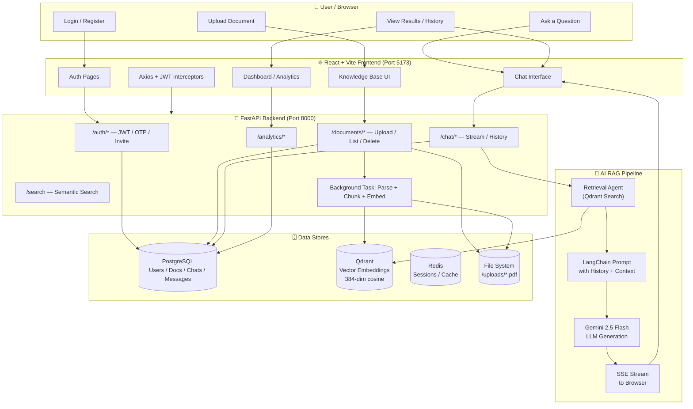
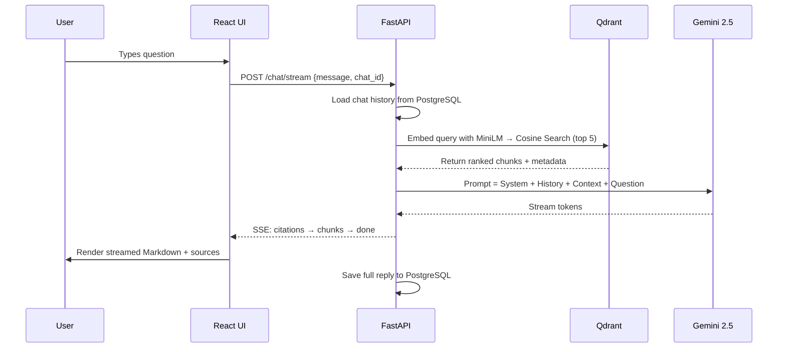
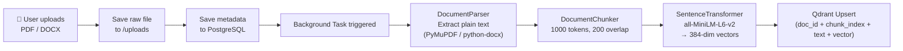
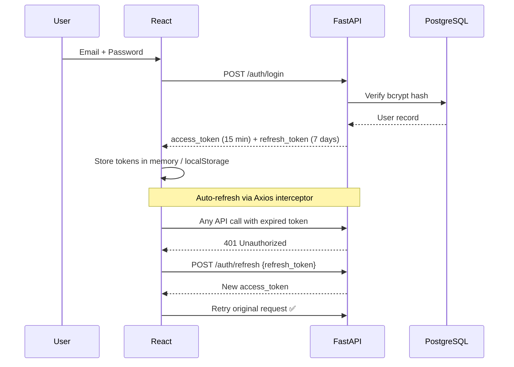

# 🏢 Enterprise Knowledge Assistant (EKA) — Use Cases & Complete Workflow

## Project Overview

**EKA** is an AI-powered internal knowledge management platform for organizations. It lets employees upload documents, ask intelligent questions about them, and get cited answers — powered by a full RAG (Retrieval-Augmented Generation) pipeline using Google Gemini + Qdrant + PostgreSQL.

---

## 👥 User Roles

| Role | Capabilities |
|------|-------------|
| **Admin** | Full access: manage users, invite team members, view all analytics, configure settings |
| **Manager** | Upload docs, manage department knowledge, view team activity |
| **Employee** | Chat with KB, search documents, bookmark, view reports |

---

## 🎯 Use Cases

### UC-1: Authentication & Onboarding

| Step | Description |
|------|-------------|
| UC-1.1 | Employee registers via email/password or Google SSO |
| UC-1.2 | Admin invites a new employee by email; a stub user is created and invite email is sent |
| UC-1.3 | Invited user receives email → clicks link → completes registration |
| UC-1.4 | Forgot password → reset via UUID token emailed to user (1-hr expiry) |
| UC-1.5 | OTP-based 2FA: user requests OTP → 6-digit code emailed → verified within 10 min |
| UC-1.6 | JWT access tokens auto-refresh via Axios interceptors (no manual re-login) |

---

### UC-2: Document Knowledge Base Management

| Step | Description |
|------|-------------|
| UC-2.1 | User uploads PDF / DOCX file via the Knowledge Base UI |
| UC-2.2 | System auto-detects department from filename prefix (e.g., `HR_Policy.pdf` → Human Resources) |
| UC-2.3 | Background task extracts text (PyMuPDF/python-docx), chunks it (1000 tokens, 200 overlap), and embeds chunks with `all-MiniLM-L6-v2` into Qdrant |
| UC-2.4 | Document metadata (title, type, uploader, department) is saved to PostgreSQL |
| UC-2.5 | Users can list, search, filter by department/tag, download, or delete documents |
| UC-2.6 | Deletion cascades: file removed from disk + vectors removed from Qdrant + record removed from PostgreSQL |

---

### UC-3: AI Conversational Chat (RAG)

| Step | Description |
|------|-------------|
| UC-3.1 | User types a question in the Chat Interface |
| UC-3.2 | If a `chat_id` exists, previous conversation history is fetched from DB and injected as context |
| UC-3.3 | The user's query is embedded with `all-MiniLM-L6-v2` and matched against Qdrant via cosine similarity (top-5 chunks retrieved) |
| UC-3.4 | Retrieved chunks + conversation history + question are injected into a LangChain prompt template |
| UC-3.5 | Google Gemini 2.5 Flash generates a grounded response with source citations |
| UC-3.6 | Response streams back to the UI token-by-token via SSE (`/chat/stream`) |
| UC-3.7 | Both the user message and the AI reply are persisted to PostgreSQL for history |
| UC-3.8 | If no relevant chunks are found, the AI politely says it doesn't know based on available documents |

---

### UC-4: Chat History & Session Management

| Step | Description |
|------|-------------|
| UC-4.1 | Each chat session has a unique `chat_id` and title (first 50 chars of opening message) |
| UC-4.2 | Users can browse all past conversations from the Chat History sidebar |
| UC-4.3 | Clicking a past chat loads the full message thread |
| UC-4.4 | Users can bookmark important messages/responses |

---

### UC-5: Search

| Step | Description |
|------|-------------|
| UC-5.1 | User types a keyword or semantic query in the search bar |
| UC-5.2 | Backend performs semantic vector search against Qdrant for relevant document chunks |
| UC-5.3 | Results are ranked by relevance (cosine similarity score) and returned with source document context |

---

### UC-6: Analytics & Reporting

| Step | Description |
|------|-------------|
| UC-6.1 | Dashboard shows KPIs: total documents, active users, chat sessions, search volume |
| UC-6.2 | Reports page provides downloadable usage summaries |
| UC-6.3 | Analytics page shows trends (document uploads over time, query frequency, etc.) |
| UC-6.4 | Agent Monitor shows the AI agent's reasoning steps and retrieval trace |

---

### UC-7: User & Department Management

| Step | Description |
|------|-------------|
| UC-7.1 | Admin views all users, their roles, status (Active / Invited / Suspended) |
| UC-7.2 | Admin invites new users by email with a specified role |
| UC-7.3 | Departments are seeded from DB (Finance, HR, Engineering, Marketing, etc.) |
| UC-7.4 | Documents can be tagged to specific departments |

---

### UC-8: Integrations

| Step | Description |
|------|-------------|
| UC-8.1 | Integrations page (currently UI-only) shows connection options for external tools |
| UC-8.2 | Planned: Slack, MS Teams, Google Drive, Confluence connectors |

---

## 🔄 Complete System Workflow

---

## 🔁 RAG Pipeline Deep Dive

---

## 📄 Document Ingestion Pipeline

---

## 🔐 Auth Flow

---

## 🛠️ Technology Map

| Layer | Technology | Purpose |
|-------|-----------|---------|
| Frontend | React 18 + TypeScript + Vite | SPA UI |
| Styling | Tailwind CSS + Lucide Icons | Design system |
| HTTP Client | Axios | API calls with JWT interceptors |
| Backend | FastAPI (Python) | REST API + SSE streaming |
| ORM | SQLAlchemy 2.0 (async) | DB queries |
| Database | PostgreSQL 15 | Relational data |
| Vector DB | Qdrant | Semantic search / embeddings |
| Embedding Model | all-MiniLM-L6-v2 | 384-dim sentence embeddings |
| LLM | Google Gemini 2.5 Flash | Answer generation |
| AI Framework | LangChain | Prompt chaining + streaming |
| Auth | JWT + bcrypt (passlib) | Secure authentication |
| Cache | Redis | Session / rate limiting |
| Document Parsing | PyMuPDF + python-docx | Text extraction |
| Containerization | Docker + Docker Compose | 5-service orchestration |

---

## 📌 Current Status & Phase 2 Roadmap

| Feature | Status |
|---------|--------|
| Document Upload + Ingestion | ✅ Complete |
| Vector Search (Qdrant) | ✅ Complete |
| RAG Chat (non-streaming) | ✅ Complete |
| RAG Chat (SSE Streaming) | ✅ Complete |
| JWT Auth (email + Google) | ✅ Complete |
| OTP / Password Reset | ✅ Complete |
| User Invite System | ✅ Complete |
| Dashboard UI | ✅ Complete (mock data) |
| Analytics (live data) | 🚧 In Progress |
| Integrations (Slack, Drive) | 🔜 Planned |
| Full RBAC enforcement | 🔜 Planned |
| Multi-tenant departments | 🔜 Planned |
