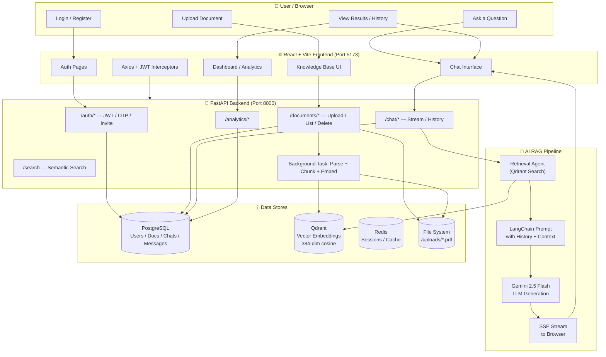
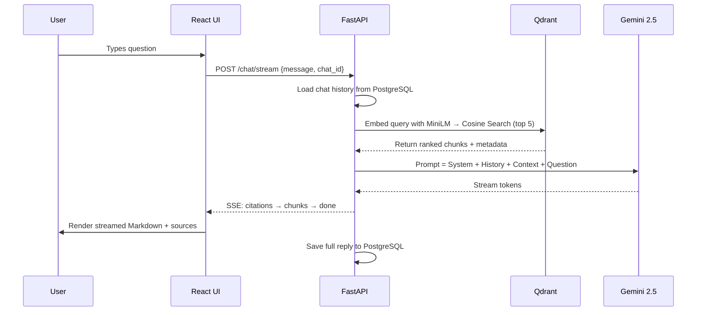
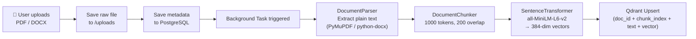
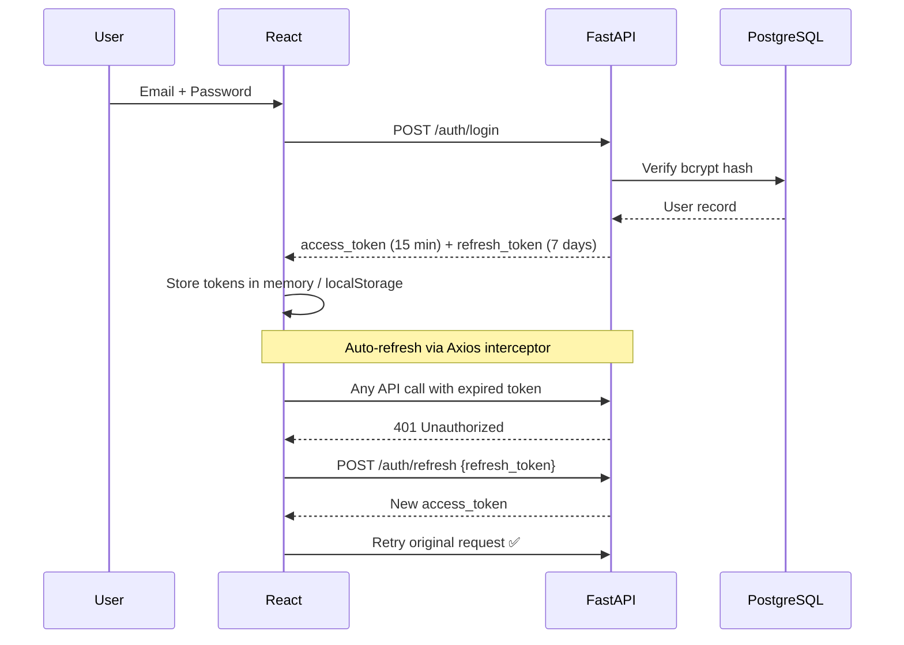

<div align="center">

# 🧠 Enterprise Knowledge Assistant (EKA)

### AI-Powered Internal Knowledge Management & RAG Conversational Platform

[](https://fastapi.tiangolo.com/)
[](https://reactjs.org/)
[](https://www.typescriptlang.org/)
[](https://www.postgresql.org/)
[](https://qdrant.tech/)
[](https://www.docker.com/)
[](https://ai.google.dev/)

*Centralize your company's knowledge. Search it semantically. Talk to it directly.*

</div>

---

## 📖 Table of Contents

- [Overview](#-overview)
- [Features](#-features)
- [Architecture](#-architecture--technology-stack)
- [System Workflow](#-complete-system-workflow)
- [RAG Pipeline Deep Dive](#-rag-pipeline-deep-dive)
- [Document Ingestion Pipeline](#-document-ingestion-pipeline)
- [Authentication Flow](#-auth-flow)
- [User Roles & Use Cases](#-user-roles--use-cases)
- [Prerequisites](#️-prerequisites)
- [Getting Started](#-getting-started)
- [Project Structure](#-project-structure)
- [Day-to-Day Commands](#-day-to-day-commands)
- [Troubleshooting](#-troubleshooting)
- [Current Status & Roadmap](#-current-status--roadmap)
- [Contributing](#-contributing)
- [License](#-license)

---

## 🚀 Overview

**Enterprise Knowledge Assistant (EKA)** is a modern, AI-powered platform for centralizing company knowledge. It allows organizations to index their documents, perform semantic search across an internal knowledge base, and get intelligent, cited answers through a full **Retrieval-Augmented Generation (RAG)** pipeline — powered by **Google Gemini**, **Qdrant**, and **PostgreSQL**.

Employees can upload documents, ask natural-language questions about them, and receive grounded, streamed answers with source citations — no more digging through folders or asking around on Slack.

---

## ✨ Features

| Category | Description |
|---|---|
| 📚 **Knowledge Base Management** | Securely upload, categorize, filter, and search company documents |
| 🤖 **AI Conversational Agent** | Chat with your company's data — EKA understands context and cites sources accurately using RAG |
| 🔐 **Secure Authentication** | JWT-based auth with encrypted passwords, auto-refresh, and strict route protection |
| 🏷️ **Department Tagging** | Organize files by department (Engineering, HR, Finance, etc.) and granular tags |
| 📊 **Analytics & Reporting** | Dashboards for usage, document volume, and query trends |
| 🧩 **Scalable Architecture** | Fully containerized microservice architecture using Docker Compose |

---

## 🏗️ Architecture & Technology Stack

<table>
<tr>
<td valign="top" width="50%">

### Backend
- **Framework:** [FastAPI](https://fastapi.tiangolo.com/) (Python)
- **Relational DB:** PostgreSQL 15 via `asyncpg` / `SQLAlchemy 2.0`
- **Vector DB:** [Qdrant](https://qdrant.tech/) — stores document embeddings for semantic search
- **Caching & Sessions:** Redis
- **AI / LLM:** Google Gemini API + LangChain
- **Authentication:** JWT, bcrypt (`passlib`)
- **Document Parsing:** PyMuPDF, python-docx

</td>
<td valign="top" width="50%">

### Frontend
- **Framework:** [React 18](https://reactjs.org/) + [Vite](https://vitejs.dev/)
- **Language:** TypeScript
- **Styling:** Tailwind CSS + Lucide Icons
- **Routing:** React Router DOM
- **HTTP Client:** Axios (with interceptors for automatic JWT refreshing)

</td>
</tr>
</table>

### 🛠️ Technology Map

| Layer | Technology | Purpose |
|-------|-----------|---------|
| Frontend | React 18 + TypeScript + Vite | SPA UI |
| Styling | Tailwind CSS + Lucide Icons | Design system |
| HTTP Client | Axios | API calls with JWT interceptors |
| Backend | FastAPI (Python) | REST API + SSE streaming |
| ORM | SQLAlchemy 2.0 (async) | DB queries |
| Database | PostgreSQL 15 | Relational data |
| Vector DB | Qdrant | Semantic search / embeddings |
| Embedding Model | all-MiniLM-L6-v2 | 384-dim sentence embeddings |
| LLM | Google Gemini 2.5 Flash | Answer generation |
| AI Framework | LangChain | Prompt chaining + streaming |
| Auth | JWT + bcrypt (passlib) | Secure authentication |
| Cache | Redis | Session / rate limiting |
| Document Parsing | PyMuPDF + python-docx | Text extraction |
| Containerization | Docker + Docker Compose | 5-service orchestration |

---

## 🔄 Complete System Workflow



---

## 🔁 RAG Pipeline Deep Dive



---

## 📄 Document Ingestion Pipeline



---

## 🔐 Auth Flow



---

## 👥 User Roles & Use Cases

| Role | Capabilities |
|------|-------------|
| **Admin** | Full access: manage users, invite team members, view all analytics, configure settings |
| **Manager** | Upload docs, manage department knowledge, view team activity |
| **Employee** | Chat with KB, search documents, bookmark, view reports |

<details>
<summary><b>🔑 UC-1: Authentication & Onboarding</b></summary>

| Step | Description |
|------|-------------|
| UC-1.1 | Employee registers via email/password or Google SSO |
| UC-1.2 | Admin invites a new employee by email; a stub user is created and invite email is sent |
| UC-1.3 | Invited user receives email → clicks link → completes registration |
| UC-1.4 | Forgot password → reset via UUID token emailed to user (1-hr expiry) |
| UC-1.5 | OTP-based 2FA: user requests OTP → 6-digit code emailed → verified within 10 min |
| UC-1.6 | JWT access tokens auto-refresh via Axios interceptors (no manual re-login) |

</details>

<details>
<summary><b>📚 UC-2: Document Knowledge Base Management</b></summary>

| Step | Description |
|------|-------------|
| UC-2.1 | User uploads PDF / DOCX file via the Knowledge Base UI |
| UC-2.2 | System auto-detects department from filename prefix (e.g., `HR_Policy.pdf` → Human Resources) |
| UC-2.3 | Background task extracts text (PyMuPDF/python-docx), chunks it (1000 tokens, 200 overlap), and embeds chunks with `all-MiniLM-L6-v2` into Qdrant |
| UC-2.4 | Document metadata (title, type, uploader, department) is saved to PostgreSQL |
| UC-2.5 | Users can list, search, filter by department/tag, download, or delete documents |
| UC-2.6 | Deletion cascades: file removed from disk + vectors removed from Qdrant + record removed from PostgreSQL |

</details>

<details>
<summary><b>🤖 UC-3: AI Conversational Chat (RAG)</b></summary>

| Step | Description |
|------|-------------|
| UC-3.1 | User types a question in the Chat Interface |
| UC-3.2 | If a `chat_id` exists, previous conversation history is fetched from DB and injected as context |
| UC-3.3 | The user's query is embedded with `all-MiniLM-L6-v2` and matched against Qdrant via cosine similarity (top-5 chunks retrieved) |
| UC-3.4 | Retrieved chunks + conversation history + question are injected into a LangChain prompt template |
| UC-3.5 | Google Gemini 2.5 Flash generates a grounded response with source citations |
| UC-3.6 | Response streams back to the UI token-by-token via SSE (`/chat/stream`) |
| UC-3.7 | Both the user message and the AI reply are persisted to PostgreSQL for history |
| UC-3.8 | If no relevant chunks are found, the AI politely says it doesn't know based on available documents |

</details>

<details>
<summary><b>🕘 UC-4: Chat History & Session Management</b></summary>

| Step | Description |
|------|-------------|
| UC-4.1 | Each chat session has a unique `chat_id` and title (first 50 chars of opening message) |
| UC-4.2 | Users can browse all past conversations from the Chat History sidebar |
| UC-4.3 | Clicking a past chat loads the full message thread |
| UC-4.4 | Users can bookmark important messages/responses |

</details>

<details>
<summary><b>🔍 UC-5: Search</b></summary>

| Step | Description |
|------|-------------|
| UC-5.1 | User types a keyword or semantic query in the search bar |
| UC-5.2 | Backend performs semantic vector search against Qdrant for relevant document chunks |
| UC-5.3 | Results are ranked by relevance (cosine similarity score) and returned with source document context |

</details>

<details>
<summary><b>📊 UC-6: Analytics & Reporting</b></summary>

| Step | Description |
|------|-------------|
| UC-6.1 | Dashboard shows KPIs: total documents, active users, chat sessions, search volume |
| UC-6.2 | Reports page provides downloadable usage summaries |
| UC-6.3 | Analytics page shows trends (document uploads over time, query frequency, etc.) |
| UC-6.4 | Agent Monitor shows the AI agent's reasoning steps and retrieval trace |

</details>

<details>
<summary><b>🏢 UC-7: User & Department Management</b></summary>

| Step | Description |
|------|-------------|
| UC-7.1 | Admin views all users, their roles, status (Active / Invited / Suspended) |
| UC-7.2 | Admin invites new users by email with a specified role |
| UC-7.3 | Departments are seeded from DB (Finance, HR, Engineering, Marketing, etc.) |
| UC-7.4 | Documents can be tagged to specific departments |

</details>

<details>
<summary><b>🔗 UC-8: Integrations</b></summary>

| Step | Description |
|------|-------------|
| UC-8.1 | Integrations page (currently UI-only) shows connection options for external tools |
| UC-8.2 | Planned: Slack, MS Teams, Google Drive, Confluence connectors |

</details>

---

## ⚙️ Prerequisites

| Tool | Required Version | Check |
|------|-------------------|-------|
| **Docker Desktop** | Latest | `docker --version` |
| **Docker Compose** | v2+ (bundled with Desktop) | `docker compose version` |
| **Git** | Optional | `git --version` |

> ✅ **That's it.** Python, Node.js, and all databases run inside Docker — nothing else needs to be installed locally.

The entire application (Frontend, Backend, Postgres, Redis, and Qdrant) is orchestrated using **Docker Compose** as 5 containers:
`eka_postgres` · `eka_redis` · `eka_qdrant` · `eka_backend` · `eka_frontend`

---

## 🏁 Getting Started

### 1️⃣ Clone the Repository

```bash
git clone <your-repo-url>
cd "AIEnterprise Knowledge"
```

### 2️⃣ Configure Environment Variables

Create a `.env` file in the root directory with the following required secrets:

```env
# Example .env configuration
POSTGRES_USER=eka_admin
POSTGRES_PASSWORD=eka_secure_pass_123
POSTGRES_DB=eka_db
JWT_SECRET=super_secret_jwt_key_change_in_prod
GEMINI_API_KEY=your_google_gemini_api_key_here
```

> [!IMPORTANT]
> Make sure your Gemini API key is valid — the RAG chat pipeline depends on it.

### 3️⃣ Start All Services

Open a terminal in the project root and run:

```bash
docker compose up -d --build
```

This will:
1. **Build** the FastAPI backend image
2. **Build** the React/Vite frontend image
3. **Pull** PostgreSQL 15, Redis 7, and Qdrant v1.7.4 images
4. **Start** all 5 containers in detached mode

> ⏱️ First build takes **3–5 minutes**. Subsequent starts take ~10 seconds.

### 4️⃣ First-Time Database Setup (Run Once Only)

```bash
# Apply the DB schema (creates all tables)
docker exec eka_backend alembic upgrade head

# Seed default departments (Finance, HR, Engineering, Marketing, etc.)
docker exec eka_backend python -m scripts.seed_db
```

### 6️⃣ (Optional) Upload a Test Dataset

To pre-populate the knowledge base with sample PDFs:

```bash
docker exec eka_backend python -m scripts.upload_dataset
```

This uploads all PDFs from `backend/test_dataset/` to the knowledge base.

---

## 📂 Project Structure

```text
AIEnterprise Knowledge/
│
├── backend/               # FastAPI Backend application
│   ├── app/               # Main application code (api, core, db, models, schemas, services)
│   ├── alembic/           # Database migration files
│   ├── scripts/           # Utility scripts (e.g., seeding the DB)
│   ├── Dockerfile         # Backend container definition
│   └── requirements.txt   # Python dependencies
│
├── frontend/              # React + Vite Frontend application
│   ├── src/               # UI code (components, pages, services, store)
│   ├── package.json       # Node dependencies
│   ├── vite.config.ts     # Vite configuration
│   └── Dockerfile         # Frontend container definition
│
├── docs/                  # Documentation
└── docker-compose.yml     # Orchestration of all 5 microservices
```

---

## 🔄 Day-to-Day Commands

```bash
# Start all containers (after first setup)
docker compose up -d

# Stop all containers (data is preserved)
docker compose down

# View live logs from all services
docker compose logs -f

# View logs for a specific service
docker compose logs -f backend
docker compose logs -f frontend

# Rebuild after code changes
docker compose up -d --build backend
docker compose up -d --build frontend

# Restart a single service
docker compose restart backend
```

### 🩺 Check Container Health

```bash
# See status of all containers
docker compose ps

# Check backend is healthy
curl http://localhost:8000/health
```

Expected response:
```json
{ "status": "ok" }
```

### 🧹 Full Reset (Wipe All Data)

```bash
# Stop containers AND remove all volumes (deletes all DB data!)
docker compose down -v

# Then re-run setup
docker compose up -d --build
docker exec eka_backend alembic upgrade head
docker exec eka_backend python -m scripts.seed_db
```

> [!CAUTION]
> `docker compose down -v` permanently deletes all your PostgreSQL, Redis, and Qdrant data.

---

## ⚠️ Troubleshooting

| Problem | Solution |
|---------|----------|
| **Port 5173 already in use** | Stop other dev servers: `npx kill-port 5173` |
| **Port 8000 already in use** | Change backend port in `docker-compose.yml` |
| **Migrations fail** | Wait 10s for postgres to be fully ready, then retry |
| **Gemini API errors** | Verify `GEMINI_API_KEY` in `.env` is valid |
| **Backend keeps restarting** | Check logs: `docker compose logs backend` |
| **Frontend blank screen** | Check logs: `docker compose logs frontend` for build errors |
| **Qdrant connection refused** | Ensure the qdrant container is running: `docker compose ps` |

---


## 🤝 Contributing

Contributions, issues, and feature requests are welcome. Feel free to open a pull request or file an issue.

## 📜 License

This project is proprietary / internal — update this section with your organization's licensing terms.

---

<div align="center">

Built with ⚛️ React · 🐍 FastAPI · 🐘 PostgreSQL · 🧠 Qdrant · ✨ Gemini

</div>
